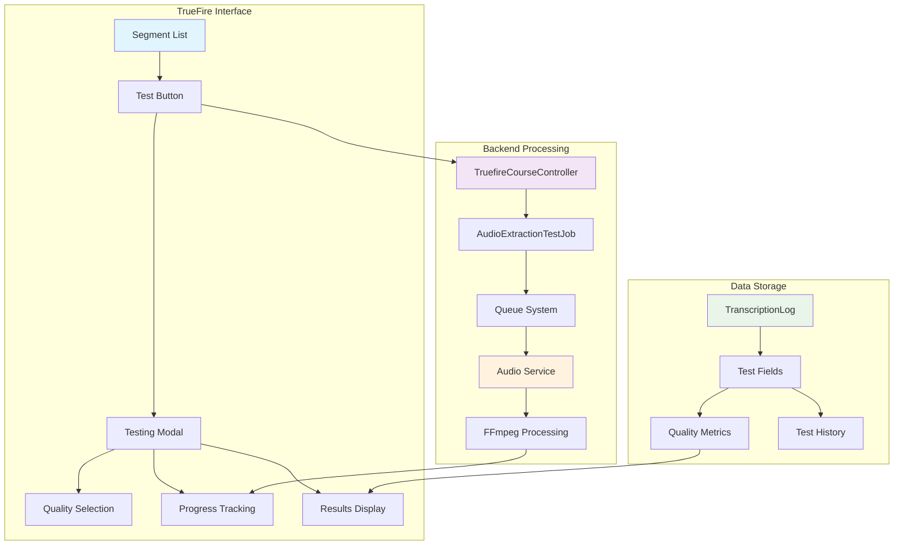

# Audio Extraction Testing Interface - Implementation Plan

## Overview
Integration of audio extraction testing capabilities directly into the existing TrueFire Courses section, enabling testing of MP4 processing through Laravel jobs with real-time progress monitoring and results analysis.

## Current System Architecture
- **Frontend**: TrueFire Courses interface with MP4 video management
- **Backend**: Laravel job queue system with AudioExtractionJob, TranscriptionJob, TerminologyRecognitionJob
- **Service**: Python audio extraction service with FFmpeg integration
- **Monitoring**: TranscriptionLog model for status tracking and Jobs dashboard

## Implementation Phases

### Phase 1: Foundation & Core Integration (Week 1-2)

#### Database Changes
```sql
-- Migration: add_audio_testing_fields_to_transcription_logs
ALTER TABLE transcription_logs ADD COLUMN is_test_extraction BOOLEAN DEFAULT FALSE;
ALTER TABLE transcription_logs ADD COLUMN test_quality_level VARCHAR(20) NULL;
ALTER TABLE transcription_logs ADD COLUMN audio_quality_metrics JSON NULL;
ALTER TABLE transcription_logs ADD COLUMN extraction_settings JSON NULL;
CREATE INDEX idx_transcription_logs_test ON transcription_logs(is_test_extraction);
```

#### Backend Implementation
**Files to Modify/Create:**
- `app/Http/Controllers/TruefireCourseController.php` - Add testing methods
- `app/Jobs/AudioExtractionTestJob.php` - New test-specific job class
- `routes/web.php` - Add testing routes

**New Controller Methods:**
```php
public function testAudioExtraction(TruefireCourse $truefireCourse, $segmentId)
public function getAudioTestResults(TruefireCourse $truefireCourse, $segmentId)
public function getAudioTestHistory()
```

**New Routes:**
```php
Route::post('/truefire-courses/{truefireCourse}/test-audio-extraction/{segmentId}', 
    [TruefireCourseController::class, 'testAudioExtraction']);
Route::get('/truefire-courses/{truefireCourse}/audio-test-results/{segmentId}', 
    [TruefireCourseController::class, 'getAudioTestResults']);
```

#### Frontend Implementation
**Files to Modify:**
- `resources/js/Pages/TruefireCourses/Show.vue` - Add testing interface
- Create `resources/js/Components/AudioExtractionTestModal.vue`

**Key Features:**
- "Test Audio Extraction" button on segment actions
- Testing modal with quality level selection
- Real-time progress tracking
- Test results display with metrics

### Phase 2: Interface Enhancement (Week 3-4)

#### Quality Level Selection
```javascript
const qualityLevels = {
  fast: { label: 'Fast', description: 'Basic processing for quick tests' },
  balanced: { label: 'Balanced', description: 'Standard quality processing' },
  high: { label: 'High', description: 'Enhanced quality with noise reduction' },
  premium: { label: 'Premium', description: 'Maximum quality with VAD' }
}
```

#### Results Display Features
- File size comparison (original vs extracted)
- Audio duration and sample rate information
- Processing time breakdown
- Quality assessment scores
- Historical test results per segment

### Phase 3: Batch Processing (Week 5-6)

#### Multi-Segment Testing
- Select multiple segments for batch testing
- Queue management for batch operations
- Progress tracking across multiple files
- Integration with existing Jobs dashboard

### Phase 4: Monitoring & Optimization (Week 7-8)

#### Enhanced Features
- Comprehensive error tracking and categorization
- Automatic retry mechanisms
- Performance analytics and trends
- Test artifact cleanup mechanisms

## Technical Architecture



## Key Implementation Requirements

### Database Schema
- Add test-specific fields to `transcription_logs` table
- Implement proper indexing for test queries
- Ensure test data isolation from production logs

### Job Queue Integration
- Extend existing `AudioExtractionJob` for test scenarios
- Implement test-specific queue handling
- Add test job prioritization and resource management

### Frontend Components
- Seamless integration with existing TrueFire interface
- Real-time progress updates using existing polling mechanisms
- Comprehensive results display with historical comparison

### API Endpoints
- RESTful endpoints for test initiation and monitoring
- Consistent with existing TrueFire API patterns
- Proper error handling and validation

## Success Criteria

### Phase 1 Deliverables
- ✅ Individual segment audio extraction testing functional
- ✅ Real-time progress tracking working
- ✅ Basic test results display implemented

### Phase 2 Deliverables
- ✅ Quality level selection and comparison working
- ✅ Historical test results storage and retrieval
- ✅ Enhanced metrics display functional

### Final System Capabilities
- Individual MP4 file testing with multiple quality levels
- Real-time progress monitoring and status updates
- Comprehensive results analysis and historical tracking
- Seamless integration with existing TrueFire workflow
- Foundation for future batch testing capabilities

## Development Notes

### Docker Commands
```bash
# Use docker container for all Laravel/PHP commands
docker exec aws-transcription-laravel php artisan migrate
docker exec aws-transcription-laravel npm run dev
```

### File Naming Conventions
- Testing files: prefix with `ai_roo_`
- Documentation: prefix with `ai_doc`
- Clean up test files after completion

### Testing Strategy
- Unit tests for new job classes and controller methods
- Integration tests for end-to-end testing workflow
- User acceptance testing for interface usability

This implementation leverages the existing robust infrastructure while adding comprehensive audio extraction testing capabilities directly into the TrueFire Courses workflow with minimal disruption to current operations.