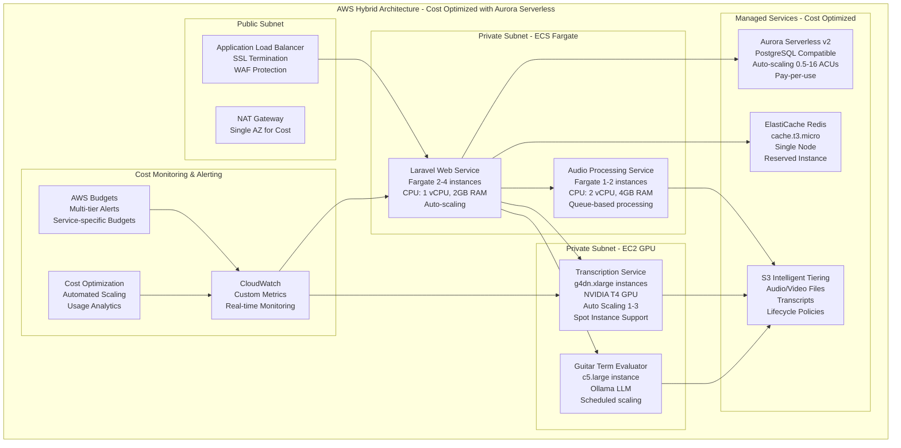

# AI Transcription Microservice - AWS Terraform Migration Plan

## Executive Summary

This document outlines a comprehensive Terraform-based migration plan to deploy the AI Transcription Microservice on AWS using a hybrid architecture that balances performance and cost optimization. The plan leverages ECS Fargate for web services, EC2 GPU instances for AI processing, Aurora Serverless for database needs, and managed services for optimal cost-performance ratio.

## Current Architecture Analysis

### Existing Components
- **Laravel Web Application**: PHP 8.2, Vue.js frontend, Inertia.js
- **Python AI Services**:
  - Transcription Service (WhisperX, PyTorch, CUDA)
  - Audio Extraction Service (FFmpeg, Python Flask)
  - Guitar Term Evaluator (LLM integration with Ollama)
- **Infrastructure**: Redis cache, SQLite database, Nginx web server
- **Proven Scale**: Successfully processed 100,000+ videos
- **GPU Requirements**: NVIDIA CUDA for AI processing acceleration

### Migration Drivers
- **Scalability**: Move from fixed local capacity to unlimited cloud scaling
- **Cost Optimization**: Leverage AWS managed services and auto-scaling
- **Reliability**: High availability and disaster recovery capabilities
- **Performance**: Dedicated GPU instances for AI workloads

## Target AWS Architecture



## Comprehensive Cost Monitoring and Alerting System

### Multi-Tier Budget Configuration

#### 6.1 AWS Budgets with Granular Alerts
```hcl
# Monthly budget with multiple alert thresholds
resource "aws_budgets_budget" "ai_transcription_monthly" {
  name         = "ai-transcription-monthly-budget"
  budget_type  = "COST"
  limit_amount = var.monthly_budget_limit
  limit_unit   = "USD"
  time_unit    = "MONTHLY"
  
  cost_filters {
    tag {
      key    = "Project"
      values = ["AI-Transcription"]
    }
  }
  
  # Progressive alert thresholds
  notification {
    comparison_operator        = "GREATER_THAN"
    threshold                 = 50
    threshold_type            = "PERCENTAGE"
    notification_type          = "ACTUAL"
    subscriber_email_addresses = var.cost_alert_emails
    subscriber_sns_topic_arns  = [aws_sns_topic.cost_alerts.arn]
  }
  
  notification {
    comparison_operator        = "GREATER_THAN"
    threshold                 = 80
    threshold_type            = "PERCENTAGE"
    notification_type          = "ACTUAL"
    subscriber_email_addresses = var.cost_alert_emails
    subscriber_sns_topic_arns  = [aws_sns_topic.cost_alerts.arn]
  }
  
  notification {
    comparison_operator        = "GREATER_THAN"
    threshold                 = 100
    threshold_type            = "PERCENTAGE"
    notification_type          = "FORECASTED"
    subscriber_email_addresses = var.cost_alert_emails
    subscriber_sns_topic_arns  = [aws_sns_topic.cost_alerts.arn]
  }
}

# Service-specific budgets for granular control
resource "aws_budgets_budget" "gpu_instances_budget" {
  name         = "ai-transcription-gpu-budget"
  budget_type  = "COST"
  limit_amount = var.gpu_budget_limit
  limit_unit   = "USD"
  time_unit    = "MONTHLY"
  
  cost_filters {
    service = ["Amazon Elastic Compute Cloud - Compute"]
    tag {
      key    = "Service"
      values = ["transcription"]
    }
  }
  
  notification {
    comparison_operator        = "GREATER_THAN"
    threshold                 = 80
    threshold_type            = "PERCENTAGE"
    notification_type          = "ACTUAL"
    subscriber_email_addresses = var.cost_alert_emails
    subscriber_sns_topic_arns  = [aws_sns_topic.gpu_cost_alerts.arn]
  }
}
```

#### 6.2 Real-Time Cost Monitoring Dashboard
```hcl
resource "aws_cloudwatch_dashboard" "cost_monitoring" {
  dashboard_name = "AI-Transcription-Cost-Monitoring"
  
  dashboard_body = jsonencode({
    widgets = [
      {
        type   = "metric"
        x      = 0
        y      = 0
        width  = 12
        height = 6
        
        properties = {
          metrics = [
            ["AWS/Billing", "EstimatedCharges", "Currency", "USD"],
            ["AWS/Billing", "EstimatedCharges", "Currency", "USD", "ServiceName", "AmazonEC2"],
            ["AWS/Billing", "EstimatedCharges", "Currency", "USD", "ServiceName", "AmazonRDS"],
            ["AWS/Billing", "EstimatedCharges", "Currency", "USD", "ServiceName", "AmazonS3"]
          ]
          view    = "timeSeries"
          stacked = false
          region  = var.aws_region
          title   = "Daily Cost Breakdown by Service"
          period  = 86400
          stat    = "Maximum"
        }
      },
      {
        type   = "metric"
        x      = 0
        y      = 6
        width  = 6
        height = 6
        
        properties = {
          metrics = [
            ["AI-Transcription/Costs", "ProcessingCostPerVideo"],
            ["AI-Transcription/GPU", "GPUUtilizationCost"]
          ]
          view    = "timeSeries"
          region  = var.aws_region
          title   = "Processing Costs"
          period  = 3600
        }
      },
      {
        type   = "number"
        x      = 6
        y      = 6
        width  = 6
        height = 6
        
        properties = {
          metrics = [
            ["AWS/Billing", "EstimatedCharges", "Currency", "USD"]
          ]
          view    = "singleValue"
          region  = var.aws_region
          title   = "Current Month Total"
          period  = 86400
          stat    = "Maximum"
        }
      }
    ]
  })
}
```

#### 6.3 Automated Cost Optimization
```hcl
# Lambda function for intelligent cost optimization
resource "aws_lambda_function" "cost_optimizer" {
  filename         = "cost_optimizer.zip"
  function_name    = "ai-transcription-cost-optimizer"
  role            = aws_iam_role.cost_optimizer_lambda.arn
  handler         = "index.handler"
  runtime         = "python3.9"
  timeout         = 300
  
  environment {
    variables = {
      ASG_NAME           = aws_autoscaling_group.transcription_service.name
      ECS_CLUSTER_NAME   = aws_ecs_cluster.main.name
      ECS_SERVICE_NAME   = aws_ecs_service.web_service.name
      COST_THRESHOLD     = var.daily_cost_threshold
      ENVIRONMENT        = var.environment
    }
  }
}

# EventBridge rule for daily cost optimization
resource "aws_cloudwatch_event_rule" "daily_cost_optimization" {
  name                = "ai-transcription-daily-cost-optimization"
  description         = "Trigger daily cost optimization analysis"
  schedule_expression = "cron(0 9 * * ? *)"  # 9 AM UTC daily
}

resource "aws_cloudwatch_event_target" "cost_optimizer_target" {
  rule      = aws_cloudwatch_event_rule.daily_cost_optimization.name
  target_id = "CostOptimizerTarget"
  arn       = aws_lambda_function.cost_optimizer.arn
}
```

## Cost Optimization Strategy

### Enhanced Monthly Cost Estimates (with Monitoring)

| Service | Configuration | Monthly Cost (USD) | Monitoring Cost |
|---------|---------------|-------------------|-----------------|
| **ECS Fargate Web** | 2-4 tasks (1 vCPU, 2GB) | $50-100 | $5 |
| **ECS Fargate Audio** | 1-2 tasks (2 vCPU, 4GB) | $60-120 | $5 |
| **EC2 GPU Transcription** | g4dn.xlarge (80% spot) | $240-720 | $10 |
| **EC2 LLM** | c5.large | $70 | $3 |
| **Aurora Serverless v2** | 0.5-16 ACUs, pay-per-use | $15-200 | $5 |
| **ElastiCache Redis** | cache.t3.micro | $15 | $2 |
| **S3 Intelligent Tiering** | 1TB with lifecycle | $20-25 | $3 |
| **CloudWatch Monitoring** | Enhanced metrics | $15-25 | - |
| **AWS Budgets** | 5 budgets with alerts | $10 | - |
| **Lambda Functions** | Cost optimization | $5-10 | - |
| **Data Transfer** | Moderate usage | $30-50 | $2 |
| **NAT Gateway** | Single AZ | $45 | - |
| **Application Load Balancer** | Standard | $25 | - |
| **Total Estimated** | | **$610-1,430/month** | **$35/month** |

### Cost Monitoring Features

#### 1. Multi-Level Budget Alerts
- **Daily Budget**: Immediate alerts for unexpected spikes
- **Monthly Budget**: Progressive alerts at 50%, 80%, 100%
- **Service-Specific**: GPU, Database, Storage budgets
- **Forecast Alerts**: Predictive cost warnings

#### 2. Real-Time Cost Tracking
- **Per-Video Processing Cost**: Track cost efficiency
- **GPU Utilization Cost**: Monitor expensive resources
- **Service-Level Breakdown**: Identify cost drivers
- **Trend Analysis**: Historical cost patterns

#### 3. Automated Cost Optimization
- **Intelligent Scaling**: Scale down during low usage
- **Spot Instance Management**: Optimize GPU costs
- **Resource Right-Sizing**: Adjust based on usage patterns
- **Idle Resource Detection**: Identify unused resources

#### 4. Cost Reporting and Analytics
- **Daily Cost Reports**: Automated email summaries
- **Weekly Trend Analysis**: Cost pattern identification
- **Monthly Optimization Recommendations**: Action items
- **ROI Analysis**: Cost per processed video metrics

## Migration Strategy

### Pre-Migration Checklist
- [ ] **Container Images**: Build and test all service images
- [ ] **Database Schema**: Convert SQLite to PostgreSQL schema
- [ ] **Environment Variables**: Map all configuration to AWS services
- [ ] **Secrets Management**: Migrate sensitive data to Secrets Manager
- [ ] **Cost Baselines**: Establish current processing costs
- [ ] **Monitoring Setup**: Configure all cost tracking systems

### Migration Execution Plan

#### Week 1: Infrastructure and Cost Monitoring Setup
1. **Day 1-2**: Deploy VPC, subnets, and networking
2. **Day 3**: Set up Aurora Serverless and ElastiCache
3. **Day 4**: Configure AWS Budgets and cost monitoring
4. **Day 5**: Set up CloudWatch dashboards and alarms

#### Week 2: Database Migration and Cost Validation
1. **Day 1-2**: Schema migration and testing
2. **Day 3-4**: Data migration using AWS DMS
3. **Day 5**: Validate cost tracking and optimization systems

#### Week 3: Container Services with Cost Controls
1. **Day 1-2**: Deploy ECS cluster and web service
2. **Day 3-4**: Deploy audio processing service
3. **Day 5**: Configure auto-scaling and cost optimization

#### Week 4: GPU Services and Cost Optimization
1. **Day 1-2**: Deploy transcription service on EC2 GPU
2. **Day 3-4**: Deploy LLM service with spot instances
3. **Day 5**: Fine-tune cost optimization automation

#### Week 5: Go-Live and Cost Monitoring Validation
1. **Day 1-2**: Final testing and cost validation
2. **Day 3**: DNS cutover and traffic migration
3. **Day 4-5**: Monitor costs and optimize based on real usage

## Terraform Project Structure

```
terraform/
├── main.tf                    # Provider configuration and backend
├── variables.tf               # Input variables and validation
├── outputs.tf                 # Output values for other systems
├── terraform.tfvars.example   # Example variable values
├── versions.tf                # Provider version constraints
├── data.tf                    # Data sources (AMIs, AZs, etc.)
├── locals.tf                  # Local values and computed data
├── modules/
│   ├── networking/
│   │   ├── main.tf           # VPC, subnets, gateways
│   │   ├── variables.tf      # Networking variables
│   │   ├── outputs.tf        # Network resource outputs
│   │   └── security_groups.tf # Security group definitions
│   ├── database/
│   │   ├── main.tf           # Aurora Serverless configuration
│   │   ├── variables.tf      # Database variables
│   │   ├── outputs.tf        # Database connection info
│   │   └── secrets.tf        # Secrets Manager integration
│   ├── cache/
│   │   ├── main.tf           # ElastiCache Redis
│   │   ├── variables.tf      # Cache variables
│   │   └── outputs.tf        # Cache endpoints
│   ├── ecs/
│   │   ├── main.tf           # ECS cluster and services
│   │   ├── variables.tf      # ECS variables
│   │   ├── outputs.tf        # Service endpoints
│   │   ├── task_definitions/ # Task definition templates
│   │   └── service_discovery.tf # AWS Cloud Map
│   ├── ec2/
│   │   ├── main.tf           # GPU instances and auto scaling
│   │   ├── variables.tf      # EC2 variables
│   │   ├── outputs.tf        # Instance information
│   │   ├── launch_templates.tf # Launch template configs
│   │   └── user_data/        # Instance initialization scripts
│   ├── storage/
│   │   ├── main.tf           # S3 buckets and policies
│   │   ├── variables.tf      # Storage variables
│   │   ├── outputs.tf        # Bucket information
│   │   └── lifecycle.tf      # S3 lifecycle policies
│   ├── monitoring/
│   │   ├── main.tf           # CloudWatch dashboards
│   │   ├── variables.tf      # Monitoring variables
│   │   ├── alarms.tf         # CloudWatch alarms
│   │   └── dashboards.tf     # Dashboard configurations
│   ├── cost-monitoring/
│   │   ├── main.tf           # AWS Budgets and cost alerts
│   │   ├── variables.tf      # Cost monitoring variables
│   │   ├── budgets.tf        # Budget configurations
│   │   ├── lambda.tf         # Cost optimization functions
│   │   └── sns.tf            # SNS topics for alerts
│   └── security/
│       ├── main.tf           # IAM roles and policies
│       ├── variables.tf      # Security variables
│       ├── iam.tf            # IAM configurations
│       └── secrets.tf        # Secrets Manager
├── environments/
│   ├── dev/
│   │   ├── main.tf           # Development environment
│   │   ├── terraform.tfvars  # Dev-specific variables
│   │   └── backend.tf        # Dev backend configuration
│   ├── staging/
│   │   ├── main.tf           # Staging environment
│   │   ├── terraform.tfvars  # Staging-specific variables
│   │   └── backend.tf        # Staging backend configuration
│   └── prod/
│       ├── main.tf           # Production environment
│       ├── terraform.tfvars  # Production-specific variables
│       └── backend.tf        # Production backend configuration
├── scripts/
│   ├── deploy.sh             # Deployment automation
│   ├── migrate.sh            # Database migration
│   ├── validate.sh           # Infrastructure validation
│   ├── cost-report.sh        # Daily cost reporting
│   └── optimize-costs.sh     # Manual cost optimization
└── lambda/
    ├── cost-analyzer/        # Cost analysis Lambda
    ├── cost-optimizer/       # Cost optimization Lambda
    └── requirements.txt      # Lambda dependencies
```

## Key Variables Configuration

### terraform.tfvars.example
```hcl
# Environment Configuration
environment = "prod"
aws_region  = "us-east-1"
project_name = "ai-transcription"

# Cost Management
monthly_budget_limit = 1500
daily_budget_limit   = 50
gpu_budget_limit     = 800
cost_alert_threshold = 1200
cost_alert_emails    = ["admin@company.com", "finance@company.com"]

# Infrastructure Sizing
web_service_cpu    = 1024
web_service_memory = 2048
web_service_count  = 2

audio_service_cpu    = 2048
audio_service_memory = 4096
audio_service_count  = 1

gpu_instance_type = "g4dn.xlarge"
gpu_max_instances = 3
gpu_min_instances = 1

# Database Configuration
aurora_min_capacity = 0.5
aurora_max_capacity = 16

# Storage Configuration
s3_lifecycle_archive_days      = 90
s3_lifecycle_deep_archive_days = 180
s3_lifecycle_expiration_days   = 2555

# Monitoring Configuration
enable_detailed_monitoring = true
enable_cost_optimization   = true
enable_cloudfront         = false
```

## Implementation Benefits

### 🎯 **Enhanced Cost Control**
- **Real-time monitoring**: Immediate visibility into spending
- **Predictive alerts**: Forecast-based cost warnings
- **Automated optimization**: Intelligent resource scaling
- **Granular budgets**: Service-specific cost controls

### 💰 **Cost Optimization Features**
- **Multi-tier alerting**: Progressive cost warnings
- **Automated scaling**: Reduce costs during low usage
- **Spot instance management**: 80% savings on GPU costs
- **Resource right-sizing**: Optimize based on actual usage

### 📊 **Advanced Analytics**
- **Cost per video**: Track processing efficiency
- **Service breakdown**: Identify cost drivers
- **Trend analysis**: Historical cost patterns
- **ROI metrics**: Business value measurement

### 🔧 **Operational Excellence**
- **Automated reporting**: Daily cost summaries
- **Optimization recommendations**: Actionable insights
- **Budget compliance**: Prevent cost overruns
- **Performance correlation**: Cost vs. performance analysis

This comprehensive plan provides a robust foundation for migrating your AI transcription microservice to AWS while maintaining strict cost control and optimization. The enhanced monitoring and alerting system ensures you'll have complete visibility into your cloud spending with automated optimization to keep costs under control.

Would you like me to proceed with implementing the Terraform scripts, or would you like to discuss any specific aspects of this cost-optimized migration plan?