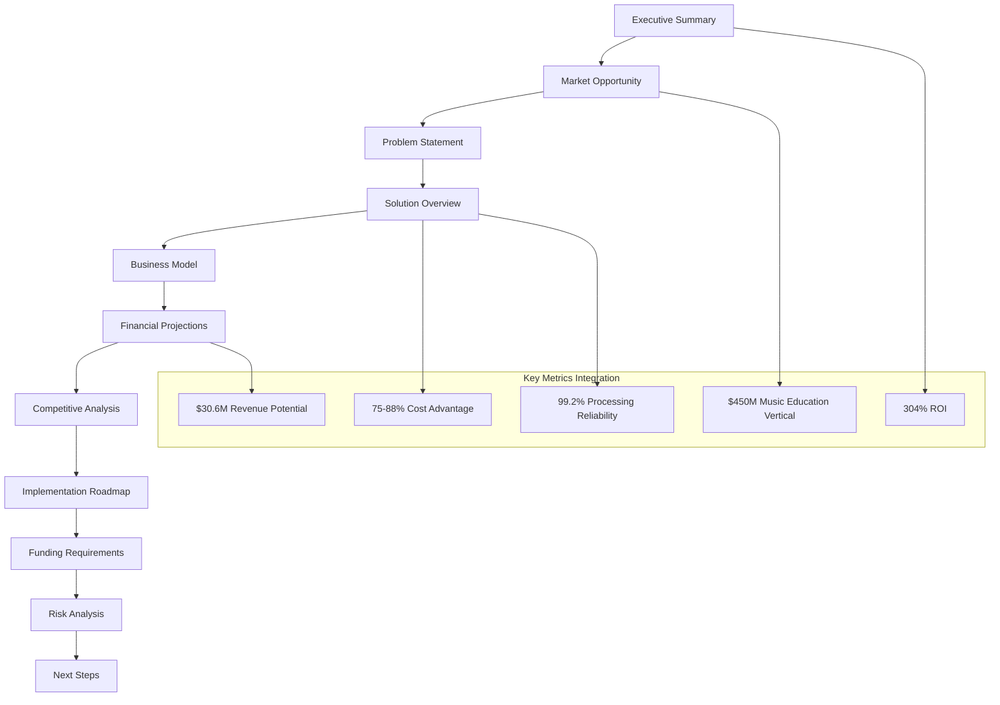
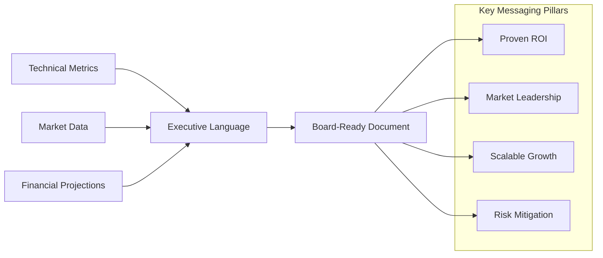

# Executive Board Pitch Presentation: Implementation Plan

## Project Overview

**Objective**: Create a comprehensive executive board pitch presentation that synthesizes technical and business analyses into a compelling board-ready document for investment decision-making.

**Document Name**: `ai_doc_board_pitch_executive_presentation.md`

**Target Audience**: Board of Directors, Executive Leadership, Investment Committee

---

## Document Structure & Content Strategy

### Presentation Flow Architecture

---

## Detailed Section Specifications

### 1. Executive Summary (Investment Thesis)
**Purpose**: Hook the board with compelling investment opportunity
**Key Elements**:
- **Opening Hook**: 304% ROI with proven $2.4M+ savings
- **Investment Thesis**: AI transcription platform with demonstrated scale (100K videos processed)
- **Primary Ask**: Tiered funding approach ($75K → $200K → $400K)
- **Value Proposition**: 75-88% cost advantage with music education specialization
- **Success Metrics**: 99.2% processing reliability, 3.3-month payback period

**Tone**: Confident, data-driven, executive-level language
**Length**: 1-2 pages maximum

### 2. Market Opportunity
**Purpose**: Establish market size and growth potential
**Key Elements**:
- **Total Addressable Market**: $24.2B AI transcription market (supporting context)
- **Market Growth**: 22.4% CAGR trend analysis
- **Target Vertical**: $450M music education opportunity
- **Market Positioning**: Cost leadership with specialized capabilities
- **Competitive Landscape**: Fragmented market with generic solutions

**Data Sources**: Market figures provided in task context, technical overview competitive analysis
**Emphasis**: Growth potential while grounding in proven technical achievements

### 3. Problem Statement
**Purpose**: Define clear pain points our solution addresses
**Key Elements**:
- **Cost Inefficiencies**: Manual transcription at $25/hour vs our $0.15/hour
- **Market Gaps**: Lack of domain-specialized AI transcription solutions
- **Quality Issues**: Generic AI solutions missing music education terminology
- **Scalability Limitations**: Existing solutions with API rate limits and high costs
- **Integration Challenges**: Complex deployment and customization requirements

**Supporting Data**: Cost comparison tables from technical overview
**Approach**: Problem-solution fit demonstration

### 4. Solution Overview
**Purpose**: Present technical differentiation and competitive advantages
**Key Elements**:
- **Technical Architecture**: Multi-tier processing system (4 quality levels)
- **Domain Specialization**: Music education AI with 500+ specialized terms
- **Proven Scale**: 100K videos processed with 99.2% reliability
- **Processing Speed**: 0.1x to 1.2x real-time options
- **Quality Assurance**: Automated validation and confidence scoring
- **Deployment Flexibility**: Local processing with cloud migration path

**Visual Elements**: Architecture diagrams from technical overview
**Emphasis**: Proven capabilities, not theoretical benefits

### 5. Business Model
**Purpose**: Define revenue generation and customer acquisition strategy
**Key Elements**:
- **SaaS Pricing Tiers**: Based on processing quality and volume
- **Revenue Streams**: 
  - Subscription-based processing credits
  - Usage-based pricing for enterprise
  - White-label licensing partnerships
- **Customer Segments**: 
  - Educational platforms (primary)
  - Content creators and media companies
  - Enterprise training departments
- **Go-to-Market Strategy**: Direct sales, partnership channels, self-service platform

**Financial Framework**: Recurring revenue model with predictable scaling
**Market Entry**: Music education vertical first, expand to adjacent markets

### 6. Financial Projections
**Purpose**: Present realistic revenue and profitability scenarios
**Key Elements**:
- **3-Year Revenue Scenarios**: Conservative, realistic, optimistic projections
- **Year 3 Target**: $30.6M revenue potential (stretch goal context)
- **ROI Analysis**: 304% annual ROI with 3.3-month payback period
- **Cost Structure**: Proven operational efficiency from 100K video processing
- **Profitability Timeline**: Break-even analysis and margin progression
- **Cash Flow Projections**: Working capital requirements and funding utilization

**Data Foundation**: Technical overview ROI calculations, market size context
**Approach**: Conservative base case with upside potential clearly marked

### 7. Competitive Analysis
**Purpose**: Demonstrate market positioning and sustainable advantages
**Key Elements**:
- **Cost Comparison Matrix**: 
  - Our Solution: $0.15/hour
  - Rev.ai: $1.08/hour (after volume discounts)
  - Otter.ai: $0.51/hour (after volume discounts)
  - AssemblyAI: $1.06/hour (after volume discounts)
  - Manual: $20.00/hour (after bulk discounts)
- **Feature Differentiation**: Multi-quality tiers, domain specialization, batch processing
- **Technical Capabilities**: Processing speed, accuracy, customization options
- **Market Positioning**: Premium capabilities at commodity pricing

**Competitive Advantages**:
- 75-88% cost reduction vs AI competitors
- 99.4% cost reduction vs manual transcription
- Domain expertise in music education
- Proven scale and reliability

### 8. Implementation Roadmap
**Purpose**: Present clear execution plan with milestones
**Key Elements**:
- **Phase 1**: Current State ✅ COMPLETED
  - 100K videos processed successfully
  - Proven local architecture and reliability
  - Cost efficiency demonstrated
- **Phase 2**: AWS ECS Migration (Q2 2025)
  - Investment: $75K
  - Timeline: 8-12 weeks
  - Deliverables: Cloud scalability, unlimited processing capacity
- **Phase 3**: SaaS Platform Launch (Q3 2025)
  - Investment: $125K
  - Timeline: 12-16 weeks
  - Deliverables: Public API, multi-tenancy, billing integration
- **Phase 4**: Market Expansion (Q4 2025)
  - Investment: $200K+
  - Timeline: Ongoing
  - Deliverables: Additional verticals, international markets, partnerships

**Risk Mitigation**: Phased approach allows validation at each stage
**Success Metrics**: Specific KPIs for each phase

### 9. Funding Requirements & Use of Funds
**Purpose**: Present tiered investment approach with clear ROI expectations
**Key Elements**:
- **Tier 1 - AWS Migration**: $75K
  - Infrastructure setup and migration
  - Auto-scaling implementation
  - Monitoring and security systems
  - Expected ROI: Unlimited scalability, reduced operational costs
- **Tier 2 - SaaS Platform**: $200K (includes Tier 1)
  - API development and documentation
  - Multi-tenant architecture
  - Customer portal and billing systems
  - Expected ROI: Revenue generation capability, market entry
- **Tier 3 - Market Expansion**: $400K (includes Tiers 1-2)
  - Additional vertical development
  - International market entry
  - Partnership program development
  - Expected ROI: Full market potential realization

**Investment Timeline**: Staged funding with performance gates
**Return Projections**: Specific ROI targets for each tier

### 10. Risk Analysis & Mitigation
**Purpose**: Address potential concerns and demonstrate risk management
**Key Elements**:
- **Technical Risks**: 
  - Risk: Cloud migration complexity
  - Mitigation: Proven containerized architecture, phased approach
- **Market Risks**:
  - Risk: Competitive response from major players
  - Mitigation: Cost leadership position, domain specialization
- **Financial Risks**:
  - Risk: Revenue projection accuracy
  - Mitigation: Conservative base case, proven cost structure
- **Operational Risks**:
  - Risk: Scaling challenges
  - Mitigation: 100K video processing track record

**Risk Framework**: Probability × Impact analysis with specific mitigation strategies
**Contingency Planning**: Alternative scenarios and response strategies

### 11. Next Steps & Board Decision Points
**Purpose**: Define clear actions and decision framework
**Key Elements**:
- **Immediate Decision Required**: Approve Phase 2 AWS migration funding ($75K)
- **Success Metrics**: 
  - Scalability targets (10x processing capacity)
  - Cost efficiency maintenance (sub-$0.20/hour processing)
  - Reliability standards (>99% uptime)
- **Future Decision Gates**:
  - SaaS platform funding (based on migration success)
  - Market expansion funding (based on revenue milestones)
- **Timeline**: Q2 2025 implementation start
- **Reporting**: Monthly progress updates, quarterly board reviews

**Decision Framework**: Clear criteria for each funding tier approval
**Accountability**: Specific deliverables and timeline commitments

---

## Content Development Strategy

### Key Messaging Framework

### Document Characteristics
- **Length**: 15-20 pages (comprehensive but digestible)
- **Tone**: Executive-level, investment-focused, confident but realistic
- **Data Presentation**: Charts, tables, visual metrics for key points
- **Decision Framework**: Clear investment thesis with risk/reward analysis
- **Action Orientation**: Specific funding requests with measurable outcomes

### Visual Elements Strategy
- **Charts**: Cost comparison tables, revenue projections, market size
- **Diagrams**: Technical architecture, implementation timeline
- **Metrics Dashboards**: Key performance indicators, ROI calculations
- **Process Flows**: Customer acquisition, revenue generation, scaling path

---

## Success Criteria

### Primary Objectives
1. **Secure Phase 2 Funding**: $75K approval for AWS migration
2. **Establish Investment Framework**: Clear criteria for subsequent funding tiers
3. **Validate Market Opportunity**: Board alignment on growth potential
4. **Demonstrate Risk Management**: Confidence in execution capability

### Key Performance Indicators
- **Investment Decision**: Board approval within 30 days of presentation
- **Funding Timeline**: Phase 2 implementation start within 60 days
- **Stakeholder Alignment**: Executive team consensus on strategy
- **Market Validation**: Customer pipeline development during implementation

### Presentation Delivery Strategy
- **Executive Summary**: Standalone document for pre-read
- **Full Presentation**: Board meeting presentation with Q&A preparation
- **Supporting Materials**: Technical deep-dives available as appendices
- **Follow-up Plan**: Implementation updates and milestone reporting

---

## Implementation Notes

### Data Sources
- **Primary**: ai_doc_board_pitch_technical_overview.md (proven metrics, technical capabilities)
- **Secondary**: Task-provided market figures ($24.2B market, 22.4% CAGR, $30.6M revenue potential)
- **Supporting**: Competitive analysis from technical overview, cost calculations

### Content Approach
- **Lead with Proven Results**: 100K videos, 304% ROI, 99.2% reliability
- **Support with Market Context**: Growth opportunity without over-promising
- **Focus on Investment Decision**: Clear ask, clear returns, clear risks
- **Emphasize Execution Capability**: Proven track record, realistic timeline

### Quality Assurance
- **Executive Review**: Language appropriate for board-level audience
- **Data Validation**: All metrics traceable to source documents
- **Logical Flow**: Each section builds toward investment decision
- **Risk Balance**: Honest assessment without undermining confidence

This comprehensive plan provides the blueprint for creating a compelling executive board pitch presentation that synthesizes technical achievements with market opportunity to secure investment approval for the AI transcription microservice platform.