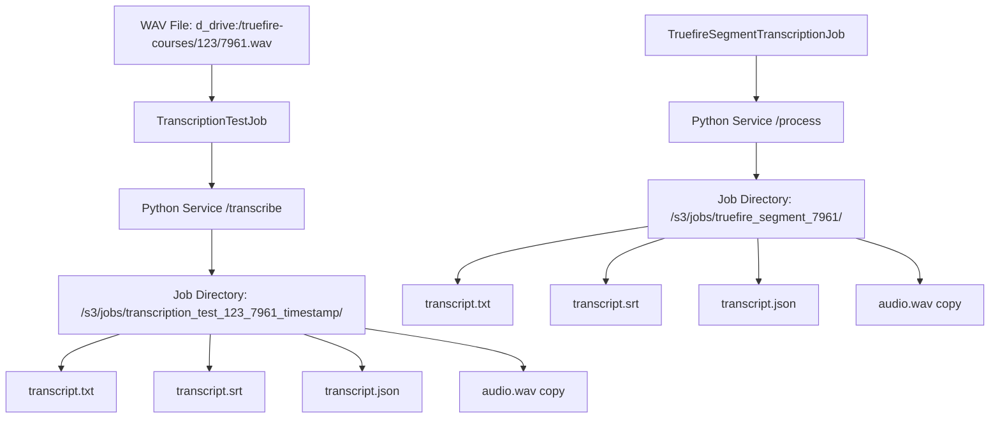

# Transcription File Storage Process Analysis

## Executive Summary

This document analyzes the current transcription file storage workflow in the AI Transcription Microservice, focusing on where transcription files are saved and how they use segment IDs for consistency with existing file structures.

## Current Transcription Workflow Overview

### 1. Transcription Test Process (TranscriptionTestJob.php)

**File Location**: [`app/laravel/app/Jobs/TranscriptionTestJob.php`](app/laravel/app/Jobs/TranscriptionTestJob.php)

**Current Behavior**:
- **Input**: WAV files stored locally on `d_drive` disk at path: `truefire-courses/{course_id}/{segment_id}.wav`
- **Storage Disk**: Always uses `d_drive` disk (mounted at `/mnt/d_drive` in containers)
- **Job ID Generation**: Uses segment ID in job naming: `transcription_test_{course_id}_{segment_id}_{timestamp}_{uniqid}`
- **Request to Python Service**: Sends audio path directly to transcription service at `/transcribe` endpoint
- **Result Storage**: Results stored in [`TranscriptionLog`](app/laravel/app/Models/TranscriptionLog.php) model in database

**Key Code Sections**:
```php
// Line 131: Always uses d_drive disk for TrueFire courses
$disk = 'd_drive';

// Line 159: Job ID includes segment ID
$jobId = $this->testId ?? 'transcription_test_' . ($this->courseId ?? 'unknown') . '_' . ($this->segmentId ?? 'unknown') . '_' . time() . '_' . uniqid();

// Line 230: Sends request to Python transcription service
$response = Http::timeout(300)->post("{$transcriptionServiceUrl}/transcribe", $requestPayload);
```

### 2. Production Transcription Process (TruefireSegmentTranscriptionJob.php)

**File Location**: [`app/laravel/app/Jobs/TruefireSegmentTranscriptionJob.php`](app/laravel/app/Jobs/TruefireSegmentTranscriptionJob.php)

**Current Behavior**:
- **Input**: Audio files from [`TruefireSegmentProcessing`](app/laravel/app/Models/TruefireSegmentProcessing.php) model
- **Job ID Generation**: Uses segment ID: `truefire_segment_{segment_id}`
- **Request to Python Service**: Sends to `/process` endpoint (different from test endpoint)
- **Result Storage**: Updates [`TruefireSegmentProcessing`](app/laravel/app/Models/TruefireSegmentProcessing.php) model

**Key Code Sections**:
```php
// Line 65: Job ID includes segment ID
'job_id' => "truefire_segment_{$this->processing->segment_id}",

// Line 76: Sends to /process endpoint
$response = Http::timeout(180)->post($transcriptionServiceUrl . '/process', $requestData);
```

### 3. Python Transcription Service (service.py)

**File Location**: [`app/services/transcription/service.py`](app/services/transcription/service.py)

**Current File Storage Behavior**:
- **Base Directory**: `/var/www/storage/app/public/s3/jobs/` (Line 41-42)
- **Job Directory Structure**: `{S3_JOBS_DIR}/{job_id}/`
- **File Naming Convention**:
  - `audio.wav` - Input audio file
  - `transcript.txt` - Plain text transcript
  - `transcript.srt` - SRT subtitle file
  - `transcript.json` - Full JSON response with metadata

**Key Code Sections**:
```python
# Lines 296-302: Standard file paths within job directory
job_dir = os.path.join(S3_JOBS_DIR, job_id)
audio_path = os.path.join(job_dir, 'audio.wav')
transcript_path = os.path.join(job_dir, 'transcript.txt')
srt_path = os.path.join(job_dir, 'transcript.srt')
json_path = os.path.join(job_dir, 'transcript.json')

# Lines 329-332: File saving process
save_transcript_to_file(transcription_result['text'], transcript_path)
save_srt(transcription_result['segments'], srt_path)
with open(json_path, 'w') as f:
    json.dump(transcription_result, f, indent=2)
```

## Current File Storage Locations

### 1. WAV Input Files (Consistent with Segment ID)
- **Location**: `d_drive:/truefire-courses/{course_id}/{segment_id}.wav`
- **Naming**: ✅ **CONSISTENT** - Uses segment ID directly
- **Example**: `d_drive:/truefire-courses/123/7961.wav`

### 2. Transcription Output Files (NOT using Segment ID)
- **Location**: `/var/www/storage/app/public/s3/jobs/{job_id}/`
- **Naming**: ❌ **INCONSISTENT** - Uses job ID, not segment ID
- **Files Created**:
  - `transcript.txt`
  - `transcript.srt` 
  - `transcript.json`
  - `audio.wav` (copy of input)

**Example Paths**:
```
/var/www/storage/app/public/s3/jobs/transcription_test_123_7961_1733745823_abc123/transcript.txt
/var/www/storage/app/public/s3/jobs/truefire_segment_7961/transcript.txt
```

### 3. Database Storage
- **TranscriptionLog Model**: Stores file paths and results in database
- **TruefireSegmentProcessing Model**: Stores processing status and file references
- **Fields**: `transcript_path`, `transcript_text`, `transcript_json`, etc.

## File Storage Consistency Analysis

### ✅ CONSISTENT Patterns
1. **WAV Input Files**: Use segment ID naming (`{segment_id}.wav`)
2. **Video Files**: Use segment ID naming (`{segment_id}.mp4`)
3. **Directory Structure**: Course-based organization (`truefire-courses/{course_id}/`)
4. **Storage Location**: All use `d_drive` disk for local storage

### ❌ INCONSISTENT Patterns
1. **Transcription Output Files**: Use job ID instead of segment ID
2. **Output Directory**: Stored in `/s3/jobs/` instead of course directory
3. **File Organization**: Not co-located with source WAV/MP4 files

## Current Transcription File Storage Workflow



## Issues Identified

### 1. File Location Inconsistency
- **Problem**: Transcription files stored in `/s3/jobs/` instead of alongside source files
- **Impact**: Files scattered across different directories, harder to manage
- **Expected**: Files should be in `d_drive:/truefire-courses/{course_id}/` with other segment files

### 2. Naming Convention Inconsistency
- **Problem**: Transcription files use job ID instead of segment ID
- **Impact**: Cannot easily correlate transcription files with source segment
- **Expected**: Files should use segment ID like `{segment_id}.txt`, `{segment_id}.srt`, `{segment_id}.json`

### 3. Missing `/transcribe` Endpoint
- **Problem**: [`TranscriptionTestJob.php`](app/laravel/app/Jobs/TranscriptionTestJob.php) calls `/transcribe` endpoint, but Python service only has `/process`
- **Impact**: Test transcriptions may fail due to missing endpoint
- **Current**: Only `/process` endpoint exists in [`service.py`](app/services/transcription/service.py)

### 4. Duplicate File Storage
- **Problem**: Python service creates copy of audio file in job directory
- **Impact**: Unnecessary disk usage, files stored in multiple locations
- **Current**: Original WAV in `d_drive`, copy in `/s3/jobs/`

## Recommendations

### 1. Implement Local Storage with Segment ID Naming
**Goal**: Store transcription files locally using segment ID for consistency

**Proposed Changes**:
- Store transcription files in: `d_drive:/truefire-courses/{course_id}/{segment_id}.txt`
- Use segment ID naming: `{segment_id}.srt`, `{segment_id}.json`
- Co-locate with existing WAV and MP4 files

### 2. Add Missing `/transcribe` Endpoint
**Goal**: Support both test and production transcription workflows

**Proposed Changes**:
- Add `/transcribe` endpoint to Python service
- Handle direct audio path processing for test jobs
- Maintain backward compatibility with `/process` endpoint

### 3. Eliminate File Duplication
**Goal**: Avoid storing multiple copies of the same files

**Proposed Changes**:
- Don't copy audio files to job directory
- Process files in-place from `d_drive` location
- Only create transcription output files

### 4. Update File Path Management
**Goal**: Consistent file path handling across all components

**Proposed Changes**:
- Update [`TranscriptionLog`](app/laravel/app/Models/TranscriptionLog.php) to expect segment-based paths
- Modify callback handling in [`TranscriptionController.php`](app/laravel/app/Http/Controllers/Api/TranscriptionController.php)
- Update frontend components to use new file locations

## Implementation Priority

### High Priority (Critical for Consistency)
1. **Fix Missing `/transcribe` Endpoint** - Required for test functionality
2. **Implement Segment ID File Naming** - Core consistency requirement
3. **Local Storage Implementation** - Align with existing file patterns

### Medium Priority (Optimization)
1. **Eliminate File Duplication** - Reduce storage usage
2. **Update Database Schema** - Support new file path patterns
3. **Frontend Updates** - Display files from new locations

### Low Priority (Enhancement)
1. **Migration Script** - Move existing files to new structure
2. **Cleanup Old Files** - Remove duplicated files
3. **Documentation Updates** - Update API documentation

## Conclusion

The current transcription file storage process has significant inconsistencies with the existing segment file organization. While WAV input files correctly use segment ID naming and local storage, transcription output files are stored in a separate directory structure using job IDs instead of segment IDs.

To achieve consistency with the existing file structure, transcription files should be stored locally on the `d_drive` disk in the same directory as the source WAV files, using segment ID-based naming conventions.

The missing `/transcribe` endpoint in the Python service also needs to be implemented to support the test transcription workflow properly.

---

**Generated**: 2025-06-08 11:04:44 AM (America/New_York)  
**Analysis Scope**: Complete transcription file storage workflow  
**Files Analyzed**: 8 core files across Laravel jobs, controllers, models, and Python service