# AWS Terraform Implementation Plan
## AI Transcription Microservice Migration

Following the AI Implementation Strategy Patterns for systematic, test-driven development with comprehensive progress tracking and phased execution.

---

## Project Overview

### Current State Analysis

#### ✅ Existing Infrastructure
- ✅ **Docker Environment**: Containerized microservices ready for migration
- ✅ **Laravel Application**: PHP 8.2 web service with Vue.js frontend
- ✅ **Python AI Services**: WhisperX transcription, audio extraction, LLM evaluation
- ✅ **Database Schema**: SQLite with established data models
- ✅ **Proven Scale**: Successfully processed 100,000+ videos
- ✅ **GPU Integration**: NVIDIA CUDA acceleration configured

#### ❌ Missing Dependencies
- ❌ **AWS Infrastructure**: No existing cloud infrastructure
- ❌ **Terraform Configuration**: No Infrastructure as Code setup
- ❌ **Aurora Database**: PostgreSQL migration required
- ❌ **Cost Monitoring**: No cloud cost tracking system
- ❌ **Auto-scaling**: No dynamic resource management

#### Integration Points
- **Container Registry**: Docker images for ECS deployment
- **Database Migration**: SQLite to Aurora PostgreSQL
- **File Storage**: Local storage to S3 with lifecycle policies
- **Monitoring**: Application logs to CloudWatch
- **Cost Control**: AWS Budgets and automated optimization

---

## Implementation Strategy

### Phased Development Approach

```mermaid
graph TB
    subgraph "Phase 1: Foundation & Cost Monitoring"
        P1A[Terraform Project Setup]
        P1B[AWS Provider Configuration]
        P1C[Cost Monitoring Infrastructure]
        P1D[Budget & Alert Configuration]
    end
    
    subgraph "Phase 2: Core Infrastructure"
        P2A[VPC & Networking]
        P2B[Security Groups]
        P2C[Aurora Serverless Setup]
        P2D[ElastiCache Redis]
    end
    
    subgraph "Phase 3: Container Services"
        P3A[ECS Cluster Creation]
        P3B[Task Definitions]
        P3C[Laravel Web Service]
        P3D[Audio Processing Service]
    end
    
    subgraph "Phase 4: GPU Infrastructure"
        P4A[EC2 Launch Templates]
        P4B[Auto Scaling Groups]
        P4C[Transcription Service]
        P4D[LLM Service Deployment]
    end
    
    subgraph "Phase 5: Storage & Optimization"
        P5A[S3 Bucket Configuration]
        P5B[Lifecycle Policies]
        P5C[Cost Optimization Lambda]
        P5D[Performance Monitoring]
    end
    
    subgraph "Phase 6: Integration & Testing"
        P6A[Database Migration]
        P6B[Application Configuration]
        P6C[End-to-End Testing]
        P6D[Cost Validation]
    end
    
    subgraph "Phase 7: Go-Live & Monitoring"
        P7A[DNS Configuration]
        P7B[SSL Certificate Setup]
        P7C[Production Deployment]
        P7D[Monitoring Validation]
    end
    
    P1A --> P1B --> P1C --> P1D
    P1D --> P2A --> P2B --> P2C --> P2D
    P2D --> P3A --> P3B --> P3C --> P3D
    P3D --> P4A --> P4B --> P4C --> P4D
    P4D --> P5A --> P5B --> P5C --> P5D
    P5D --> P6A --> P6B --> P6C --> P6D
    P6D --> P7A --> P7B --> P7C --> P7D
```



---

## Progress Tracking System

### Multi-Dimensional Progress Tracking

| Phase | Description | Status | Implementation | Testing | Commit | Findings |
|-------|-------------|--------|----------------|---------|--------|----------|
| **Phase 1.1** | Terraform Project Structure | ⏸️ Pending | ⏸️ Pending | ⏸️ Pending | - | Initial setup required |
| **Phase 1.2** | AWS Provider & Backend Config | ⏸️ Pending | ⏸️ Pending | ⏸️ Pending | - | S3 backend for state |
| **Phase 1.3** | Cost Monitoring Infrastructure | ⏸️ Pending | ⏸️ Pending | ⏸️ Pending | - | AWS Budgets & CloudWatch |
| **Phase 1.4** | Budget Alerts & SNS Topics | ⏸️ Pending | ⏸️ Pending | ⏸️ Pending | - | Multi-tier alerting |
| **Phase 2.1** | VPC & Subnet Configuration | ⏸️ Pending | ⏸️ Pending | ⏸️ Pending | - | Multi-AZ setup |
| **Phase 2.2** | Security Groups & NACLs | ⏸️ Pending | ⏸️ Pending | ⏸️ Pending | - | Least privilege access |
| **Phase 2.3** | Aurora Serverless v2 Setup | ⏸️ Pending | ⏸️ Pending | ⏸️ Pending | - | PostgreSQL compatibility |
| **Phase 2.4** | ElastiCache Redis Cluster | ⏸️ Pending | ⏸️ Pending | ⏸️ Pending | - | Single node for cost |
| **Phase 3.1** | ECS Cluster & Service Discovery | ⏸️ Pending | ⏸️ Pending | ⏸️ Pending | - | Fargate configuration |
| **Phase 3.2** | Task Definition Templates | ⏸️ Pending | ⏸️ Pending | ⏸️ Pending | - | Container specifications |
| **Phase 3.3** | Laravel Web Service Deployment | ⏸️ Pending | ⏸️ Pending | ⏸️ Pending | - | Auto-scaling 2-4 tasks |
| **Phase 3.4** | Audio Processing Service | ⏸️ Pending | ⏸️ Pending | ⏸️ Pending | - | Queue-based processing |
| **Phase 4.1** | GPU Instance Launch Templates | ⏸️ Pending | ⏸️ Pending | ⏸️ Pending | - | g4dn.xlarge with CUDA |
| **Phase 4.2** | Auto Scaling Groups | ⏸️ Pending | ⏸️ Pending | ⏸️ Pending | - | Spot instance support |
| **Phase 4.3** | Transcription Service Deployment | ⏸️ Pending | ⏸️ Pending | ⏸️ Pending | - | WhisperX integration |
| **Phase 4.4** | LLM Service Configuration | ⏸️ Pending | ⏸️ Pending | ⏸️ Pending | - | Ollama deployment |
| **Phase 5.1** | S3 Bucket & IAM Policies | ⏸️ Pending | ⏸️ Pending | ⏸️ Pending | - | Intelligent tiering |
| **Phase 5.2** | Lifecycle Policy Configuration | ⏸️ Pending | ⏸️ Pending | ⏸️ Pending | - | Archive & expiration |
| **Phase 5.3** | Cost Optimization Lambda | ⏸️ Pending | ⏸️ Pending | ⏸️ Pending | - | Automated scaling |
| **Phase 5.4** | Performance Monitoring Setup | ⏸️ Pending | ⏸️ Pending | ⏸️ Pending | - | Custom metrics |
| **Phase 6.1** | Database Schema Migration | ⏸️ Pending | ⏸️ Pending | ⏸️ Pending | - | SQLite to PostgreSQL |
| **Phase 6.2** | Application Configuration | ⏸️ Pending | ⏸️ Pending | ⏸️ Pending | - | Environment variables |
| **Phase 6.3** | End-to-End Testing | ⏸️ Pending | ⏸️ Pending | ⏸️ Pending | - | Full workflow validation |
| **Phase 6.4** | Cost Validation & Optimization | ⏸️ Pending | ⏸️ Pending | ⏸️ Pending | - | Budget compliance |
| **Phase 7.1** | Route 53 DNS Configuration | ⏸️ Pending | ⏸️ Pending | ⏸️ Pending | - | Domain setup |
| **Phase 7.2** | ACM SSL Certificate | ⏸️ Pending | ⏸️ Pending | ⏸️ Pending | - | HTTPS termination |
| **Phase 7.3** | Production Deployment | ⏸️ Pending | ⏸️ Pending | ⏸️ Pending | - | Traffic cutover |
| **Phase 7.4** | Monitoring & Alerting Validation | ⏸️ Pending | ⏸️ Pending | ⏸️ Pending | - | Full system monitoring |

**Status Legend**:
- ⏸️ Pending → 🚧 In Progress → ✅ Completed
- 🔨 Implementation in progress
- 🧪 Testing in progress

---

## Detailed Implementation Plan

### Phase 1: Foundation & Cost Monitoring (Week 1)

#### Phase 1.1: Terraform Project Structure
**Objective**: Create modular Terraform project with proper organization

**Implementation Tasks**:
- [ ] Create main Terraform directory structure
- [ ] Set up module directories (networking, database, ecs, ec2, storage, monitoring, cost-monitoring, security)
- [ ] Configure provider versions and constraints
- [ ] Set up variable definitions and validation
- [ ] Create example terraform.tfvars files

**Test Criteria**:
- [ ] `terraform init` runs successfully
- [ ] `terraform validate` passes
- [ ] `terraform plan` generates valid plan
- [ ] Module structure follows best practices

**Success Metrics**:
- Clean module organization
- Proper variable validation
- No Terraform syntax errors

#### Phase 1.2: AWS Provider & Backend Configuration
**Objective**: Configure Terraform backend and AWS provider

**Implementation Tasks**:
- [ ] Set up S3 backend for state management
- [ ] Configure DynamoDB table for state locking
- [ ] Set up AWS provider with proper authentication
- [ ] Configure multiple environment support (dev, staging, prod)

**Test Criteria**:
- [ ] State stored in S3 successfully
- [ ] State locking works with DynamoDB
- [ ] Multiple environments can be deployed
- [ ] Provider authentication works

#### Phase 1.3: Cost Monitoring Infrastructure
**Objective**: Implement comprehensive cost tracking system

**Implementation Tasks**:
- [ ] Create AWS Budgets with multi-tier alerts
- [ ] Set up CloudWatch billing alarms
- [ ] Configure SNS topics for cost alerts
- [ ] Create cost monitoring dashboard
- [ ] Implement custom cost metrics

**Test Criteria**:
- [ ] Budget alerts trigger at correct thresholds
- [ ] CloudWatch dashboard displays cost data
- [ ] SNS notifications work properly
- [ ] Custom metrics are collected

**Cost Impact**: $10/month for budgets and monitoring

#### Phase 1.4: Budget Alerts & SNS Topics
**Objective**: Configure automated cost alerting system

**Implementation Tasks**:
- [ ] Set up progressive budget alerts (50%, 80%, 100%)
- [ ] Configure service-specific budgets
- [ ] Create SNS topics for different alert types
- [ ] Set up email and webhook notifications
- [ ] Test alert escalation procedures

**Test Criteria**:
- [ ] Alerts trigger at correct cost thresholds
- [ ] Email notifications are received
- [ ] Webhook integrations work
- [ ] Escalation procedures are followed

### Phase 2: Core Infrastructure (Week 2)

#### Phase 2.1: VPC & Subnet Configuration
**Objective**: Create secure, scalable network infrastructure

**Implementation Tasks**:
- [ ] Create VPC with proper CIDR blocks
- [ ] Set up public and private subnets across multiple AZs
- [ ] Configure Internet Gateway and NAT Gateway
- [ ] Set up route tables and associations
- [ ] Implement VPC Flow Logs for monitoring

**Test Criteria**:
- [ ] VPC created with correct CIDR
- [ ] Subnets span multiple availability zones
- [ ] Internet connectivity works from public subnets
- [ ] Private subnets can reach internet via NAT
- [ ] VPC Flow Logs are collecting data

#### Phase 2.2: Security Groups & NACLs
**Objective**: Implement least-privilege security controls

**Implementation Tasks**:
- [ ] Create security groups for each service tier
- [ ] Configure ingress/egress rules with minimal access
- [ ] Set up NACLs for additional security layer
- [ ] Document security group relationships
- [ ] Implement security group monitoring

**Test Criteria**:
- [ ] Only required ports are open
- [ ] Security groups follow least privilege
- [ ] NACLs provide additional protection
- [ ] Security monitoring is active

#### Phase 2.3: Aurora Serverless v2 Setup
**Objective**: Deploy cost-optimized PostgreSQL database

**Implementation Tasks**:
- [ ] Create Aurora Serverless v2 cluster
- [ ] Configure auto-scaling (0.5-16 ACUs)
- [ ] Set up database subnet group
- [ ] Configure backup and maintenance windows
- [ ] Implement database monitoring

**Test Criteria**:
- [ ] Database cluster is accessible
- [ ] Auto-scaling works correctly
- [ ] Backups are configured
- [ ] Monitoring shows database metrics
- [ ] Connection pooling is optimized

**Cost Impact**: $15-200/month based on usage

#### Phase 2.4: ElastiCache Redis Cluster
**Objective**: Deploy Redis cache for application performance

**Implementation Tasks**:
- [ ] Create ElastiCache Redis cluster
- [ ] Configure cache.t3.micro for cost optimization
- [ ] Set up cache subnet group
- [ ] Configure backup and maintenance
- [ ] Implement cache monitoring

**Test Criteria**:
- [ ] Redis cluster is accessible
- [ ] Cache operations work correctly
- [ ] Backup configuration is active
- [ ] Performance metrics are collected

**Cost Impact**: $15/month

### Phase 3: Container Services (Week 3)

#### Phase 3.1: ECS Cluster & Service Discovery
**Objective**: Create container orchestration platform

**Implementation Tasks**:
- [ ] Create ECS Fargate cluster
- [ ] Set up AWS Cloud Map for service discovery
- [ ] Configure cluster logging
- [ ] Set up IAM roles for ECS tasks
- [ ] Implement cluster monitoring

**Test Criteria**:
- [ ] ECS cluster is operational
- [ ] Service discovery works
- [ ] Task roles have correct permissions
- [ ] Cluster metrics are available

#### Phase 3.2: Task Definition Templates
**Objective**: Define container specifications for services

**Implementation Tasks**:
- [ ] Create task definitions for Laravel web service
- [ ] Create task definitions for audio processing service
- [ ] Configure resource requirements (CPU, memory)
- [ ] Set up environment variable management
- [ ] Configure logging and monitoring

**Test Criteria**:
- [ ] Task definitions are valid
- [ ] Resource allocations are appropriate
- [ ] Environment variables are properly configured
- [ ] Logging is working

#### Phase 3.3: Laravel Web Service Deployment
**Objective**: Deploy web application with auto-scaling

**Implementation Tasks**:
- [ ] Deploy Laravel service to ECS
- [ ] Configure Application Load Balancer
- [ ] Set up auto-scaling (2-4 tasks)
- [ ] Configure health checks
- [ ] Implement service monitoring

**Test Criteria**:
- [ ] Web service is accessible via ALB
- [ ] Auto-scaling responds to load
- [ ] Health checks are passing
- [ ] Application logs are captured

**Cost Impact**: $50-100/month

#### Phase 3.4: Audio Processing Service
**Objective**: Deploy audio processing microservice

**Implementation Tasks**:
- [ ] Deploy audio processing service to ECS
- [ ] Configure SQS queue for job processing
- [ ] Set up auto-scaling based on queue depth
- [ ] Configure S3 integration for file processing
- [ ] Implement processing monitoring

**Test Criteria**:
- [ ] Audio processing jobs complete successfully
- [ ] Queue-based scaling works
- [ ] S3 file operations work correctly
- [ ] Processing metrics are collected

**Cost Impact**: $60-120/month

### Phase 4: GPU Infrastructure (Week 4)

#### Phase 4.1: GPU Instance Launch Templates
**Objective**: Configure GPU instances for AI processing

**Implementation Tasks**:
- [ ] Create launch templates for g4dn.xlarge instances
- [ ] Configure NVIDIA CUDA drivers
- [ ] Set up user data scripts for initialization
- [ ] Configure instance monitoring
- [ ] Set up spot instance support

**Test Criteria**:
- [ ] GPU instances launch successfully
- [ ] CUDA drivers are properly installed
- [ ] Spot instances work correctly
- [ ] Instance monitoring is active

#### Phase 4.2: Auto Scaling Groups
**Objective**: Implement dynamic GPU scaling

**Implementation Tasks**:
- [ ] Create auto scaling groups for transcription service
- [ ] Configure scaling policies based on queue depth
- [ ] Set up mixed instance policies (on-demand + spot)
- [ ] Configure health checks
- [ ] Implement cost optimization

**Test Criteria**:
- [ ] Auto scaling responds to demand
- [ ] Mixed instance policies work
- [ ] Health checks prevent unhealthy instances
- [ ] Cost optimization is effective

#### Phase 4.3: Transcription Service Deployment
**Objective**: Deploy WhisperX transcription service

**Implementation Tasks**:
- [ ] Deploy transcription service to GPU instances
- [ ] Configure SQS integration for job processing
- [ ] Set up S3 integration for audio files
- [ ] Configure transcription quality settings
- [ ] Implement transcription monitoring

**Test Criteria**:
- [ ] Transcription jobs complete successfully
- [ ] GPU utilization is optimized
- [ ] Audio files are processed correctly
- [ ] Quality metrics meet requirements

**Cost Impact**: $240-720/month (with 80% spot savings)

#### Phase 4.4: LLM Service Configuration
**Objective**: Deploy guitar term evaluation service

**Implementation Tasks**:
- [ ] Deploy Ollama LLM service to c5.large instances
- [ ] Configure model loading and caching
- [ ] Set up API endpoints for evaluation
- [ ] Configure scheduled scaling
- [ ] Implement evaluation monitoring

**Test Criteria**:
- [ ] LLM service responds correctly
- [ ] Model evaluations are accurate
- [ ] Scheduled scaling works
- [ ] Performance metrics are collected

**Cost Impact**: $70/month

### Phase 5: Storage & Optimization (Week 5)

#### Phase 5.1: S3 Bucket & IAM Policies
**Objective**: Configure secure, cost-optimized storage

**Implementation Tasks**:
- [ ] Create S3 buckets for different content types
- [ ] Configure Intelligent Tiering
- [ ] Set up IAM policies for least privilege access
- [ ] Configure bucket versioning and encryption
- [ ] Implement access logging

**Test Criteria**:
- [ ] Buckets are properly secured
- [ ] Intelligent Tiering is active
- [ ] Access policies work correctly
- [ ] Encryption is enabled

#### Phase 5.2: Lifecycle Policy Configuration
**Objective**: Implement automated storage cost optimization

**Implementation Tasks**:
- [ ] Configure lifecycle policies for archiving
- [ ] Set up transition to IA after 30 days
- [ ] Configure Glacier archiving after 90 days
- [ ] Set up expiration policies
- [ ] Monitor lifecycle transitions

**Test Criteria**:
- [ ] Lifecycle policies are active
- [ ] Transitions happen on schedule
- [ ] Cost savings are realized
- [ ] Data integrity is maintained

**Cost Impact**: $20-25/month with lifecycle optimization

#### Phase 5.3: Cost Optimization Lambda
**Objective**: Implement automated cost optimization

**Implementation Tasks**:
- [ ] Create Lambda function for cost analysis
- [ ] Configure EventBridge triggers for daily optimization
- [ ] Implement intelligent scaling decisions
- [ ] Set up cost reporting
- [ ] Configure optimization alerts

**Test Criteria**:
- [ ] Lambda function executes successfully
- [ ] Cost optimization decisions are made
- [ ] Scaling adjustments are applied
- [ ] Cost reports are generated

**Cost Impact**: $5-10/month

#### Phase 5.4: Performance Monitoring Setup
**Objective**: Implement comprehensive system monitoring

**Implementation Tasks**:
- [ ] Set up CloudWatch custom metrics
- [ ] Configure application performance monitoring
- [ ] Create performance dashboards
- [ ] Set up performance alerts
- [ ] Implement cost-performance correlation

**Test Criteria**:
- [ ] Custom metrics are collected
- [ ] Performance dashboards are functional
- [ ] Alerts trigger appropriately
- [ ] Cost-performance data is available

### Phase 6: Integration & Testing (Week 6)

#### Phase 6.1: Database Schema Migration
**Objective**: Migrate from SQLite to Aurora PostgreSQL

**Implementation Tasks**:
- [ ] Convert SQLite schema to PostgreSQL
- [ ] Create database migration scripts
- [ ] Set up AWS DMS for data migration
- [ ] Validate data integrity
- [ ] Test application connectivity

**Test Criteria**:
- [ ] Schema conversion is complete
- [ ] Data migration is successful
- [ ] Data integrity is verified
- [ ] Application connects successfully

#### Phase 6.2: Application Configuration
**Objective**: Configure applications for AWS environment

**Implementation Tasks**:
- [ ] Update environment variables for AWS services
- [ ] Configure Secrets Manager integration
- [ ] Set up service discovery endpoints
- [ ] Configure logging and monitoring
- [ ] Test all service integrations

**Test Criteria**:
- [ ] All services connect properly
- [ ] Secrets are managed securely
- [ ] Service discovery works
- [ ] Monitoring is comprehensive

#### Phase 6.3: End-to-End Testing
**Objective**: Validate complete system functionality

**Implementation Tasks**:
- [ ] Test video upload and processing workflow
- [ ] Validate transcription accuracy
- [ ] Test audio extraction pipeline
- [ ] Verify guitar term evaluation
- [ ] Load test system performance

**Test Criteria**:
- [ ] Complete workflows function correctly
- [ ] Performance meets requirements
- [ ] Error handling works properly
- [ ] System scales under load

#### Phase 6.4: Cost Validation & Optimization
**Objective**: Ensure cost targets are met

**Implementation Tasks**:
- [ ] Validate actual costs against estimates
- [ ] Optimize resource allocations
- [ ] Fine-tune auto-scaling policies
- [ ] Validate cost monitoring accuracy
- [ ] Document cost optimization strategies

**Test Criteria**:
- [ ] Costs are within budget targets
- [ ] Cost monitoring is accurate
- [ ] Optimization strategies are effective
- [ ] Budget alerts work correctly

### Phase 7: Go-Live & Monitoring (Week 7)

#### Phase 7.1: Route 53 DNS Configuration
**Objective**: Configure DNS for production access

**Implementation Tasks**:
- [ ] Set up Route 53 hosted zone
- [ ] Configure DNS records for services
- [ ] Set up health checks
- [ ] Configure failover routing
- [ ] Test DNS resolution

**Test Criteria**:
- [ ] DNS resolution works correctly
- [ ] Health checks are functional
- [ ] Failover routing works
- [ ] SSL certificates are valid

#### Phase 7.2: ACM SSL Certificate
**Objective**: Secure all communications with SSL/TLS

**Implementation Tasks**:
- [ ] Request SSL certificates via ACM
- [ ] Configure certificate validation
- [ ] Update load balancer configurations
- [ ] Test HTTPS connectivity
- [ ] Set up certificate renewal monitoring

**Test Criteria**:
- [ ] SSL certificates are valid
- [ ] HTTPS connections work
- [ ] Certificate renewal is automated
- [ ] Security headers are configured

#### Phase 7.3: Production Deployment
**Objective**: Cut over to production AWS environment

**Implementation Tasks**:
- [ ] Perform final data synchronization
- [ ] Update DNS to point to AWS
- [ ] Monitor traffic cutover
- [ ] Validate all services are operational
- [ ] Implement rollback procedures

**Test Criteria**:
- [ ] Traffic cutover is successful
- [ ] All services are operational
- [ ] Performance meets expectations
- [ ] Rollback procedures are tested

#### Phase 7.4: Monitoring & Alerting Validation
**Objective**: Ensure comprehensive system monitoring

**Implementation Tasks**:
- [ ] Validate all monitoring systems
- [ ] Test alert escalation procedures
- [ ] Verify cost monitoring accuracy
- [ ] Document operational procedures
- [ ] Train team on new monitoring tools

**Test Criteria**:
- [ ] All monitoring systems are operational
- [ ] Alerts are properly configured
- [ ] Cost tracking is accurate
- [ ] Team is trained on operations

---

## Success Criteria

### Functional Requirements
- ✅ **Video Processing**: Complete video-to-transcript workflow operational
- ✅ **Audio Extraction**: FFmpeg-based audio processing functional
- ✅ **AI Transcription**: WhisperX transcription with GPU acceleration
- ✅ **Guitar Term Evaluation**: LLM-based terminology analysis
- ✅ **Web Interface**: Laravel application accessible and responsive
- ✅ **Auto-scaling**: Dynamic resource scaling based on demand

### Technical Requirements
- ✅ **Performance**: Processing time ≤ current local performance
- ✅ **Reliability**: 99.9% uptime with proper error handling
- ✅ **Security**: All communications encrypted, least privilege access
- ✅ **Scalability**: Handle 10x current processing volume
- ✅ **Cost Optimization**: Stay within $610-1,430/month budget
- ✅ **Monitoring**: Comprehensive observability and alerting

### Business Requirements
- ✅ **Cost Savings**: 75-88% savings vs. competitors
- ✅ **Unlimited Scale**: No processing volume limitations
- ✅ **High Availability**: Multi-AZ deployment with failover
- ✅ **Disaster Recovery**: Automated backup and recovery procedures
- ✅ **Compliance**: Security and data protection requirements met

---

## Risk Assessment & Mitigation

### High-Risk Areas

#### **Database Migration Risk**
- **Risk**: Data loss or corruption during SQLite to PostgreSQL migration
- **Probability**: Medium
- **Impact**: High
- **Mitigation**: 
  - Comprehensive backup before migration
  - Staged migration with validation
  - Rollback procedures tested
  - Data integrity verification at each step

#### **GPU Instance Availability**
- **Risk**: Spot instance interruptions affecting processing
- **Probability**: Medium
- **Impact**: Medium
- **Mitigation**:
  - Mixed instance policies (spot + on-demand)
  - Queue-based processing with retry logic
  - Multiple availability zone deployment
  - Graceful handling of instance termination

#### **Cost Overrun Risk**
- **Risk**: Actual costs exceed budget estimates
- **Probability**: Low
- **Impact**: High
- **Mitigation**:
  - Comprehensive cost monitoring and alerts
  - Automated cost optimization
  - Conservative resource sizing initially
  - Regular cost review and optimization

### Medium-Risk Areas

#### **Performance Degradation**
- **Risk**: Cloud performance worse than local processing
- **Probability**: Low
- **Impact**: Medium
- **Mitigation**:
  - Performance testing before cutover
  - GPU optimization and tuning
  - CDN and caching strategies
  - Performance monitoring and alerting

#### **Integration Complexity**
- **Risk**: Service integration issues causing failures
- **Probability**: Medium
- **Impact**: Medium
- **Mitigation**:
  - Comprehensive integration testing
  - Staged deployment approach
  - Service mesh for reliable communication
  - Circuit breaker patterns

---

## Monitoring Strategy

### Cost Monitoring
- **Real-time Dashboards**: CloudWatch cost dashboards
- **Budget Alerts**: Progressive alerts at 50%, 80%, 100%
- **Service-specific Budgets**: GPU, database, storage budgets
- **Automated Optimization**: Lambda-based cost optimization
- **Daily Reports**: Automated cost analysis and recommendations

### Performance Monitoring
- **Application Metrics**: Custom CloudWatch metrics
- **Infrastructure Metrics**: EC2, ECS, RDS monitoring
- **User Experience**: Response time and error rate tracking
- **GPU Utilization**: CUDA performance monitoring
- **Queue Depth**: Processing backlog monitoring

### Security Monitoring
- **VPC Flow Logs**: Network traffic analysis
- **CloudTrail**: API call auditing
- **GuardDuty**: Threat detection
- **Config**: Compliance monitoring
- **Security Hub**: Centralized security findings

---

## Git Workflow & Milestones

### Milestone-Based Commit Strategy

**Phase Completion Commits**:
```bash
git add .
git commit -m "feat: Complete Phase X.Y - [Description]

- [Specific implementation details]
- [Test results and validation]
- [Performance metrics achieved]
- [Cost impact documented]
- [Next phase dependencies ready]"
```

**Major Milestones**:
1. **Infrastructure Foundation** (End of Phase 2)
2. **Container Services Operational** (End of Phase 3)
3. **GPU Services Deployed** (End of Phase 4)
4. **Storage & Optimization Complete** (End of Phase 5)
5. **Integration Testing Passed** (End of Phase 6)
6. **Production Go-Live** (End of Phase 7)

---

## Implementation Timeline

### 7-Week Implementation Schedule

| Week | Phase | Key Deliverables | Success Criteria |
|------|-------|------------------|------------------|
| **Week 1** | Foundation & Cost Monitoring | Terraform setup, cost monitoring | Budget alerts functional |
| **Week 2** | Core Infrastructure | VPC, Aurora, Redis | Database accessible |
| **Week 3** | Container Services | ECS, Laravel, Audio processing | Web service operational |
| **Week 4** | GPU Infrastructure | EC2 GPU, Transcription, LLM | AI services functional |
| **Week 5** | Storage & Optimization | S3, Lifecycle, Cost optimization | Storage optimized |
| **Week 6** | Integration & Testing | Migration, E2E testing | Full workflow tested |
| **Week 7** | Go-Live & Monitoring | DNS, SSL, Production cutover | System operational |

---

## Next Steps

### Immediate Actions Required

1. **AWS Account Setup**: Ensure AWS account with appropriate permissions
2. **Terraform Installation**: Install Terraform CLI and configure AWS credentials
3. **Repository Setup**: Create dedicated repository for Terraform code
4. **Cost Budget Approval**: Confirm monthly budget allocation ($610-1,430)
5. **Team Coordination**: Identify stakeholders for each phase

### Implementation Readiness Checklist

- [ ] AWS account with admin permissions configured
- [ ] Terraform CLI installed and tested
- [ ] Git repository created for infrastructure code
- [ ] Cost budget approved by stakeholders
- [ ] Team roles and responsibilities defined
- [ ] Communication plan established
- [ ] Rollback procedures documented
- [ ] Success criteria agreed upon

---

## Conclusion

This implementation plan provides a systematic, test-driven approach to migrating the AI Transcription Microservice to AWS with comprehensive cost optimization and monitoring. The phased approach ensures manageable complexity while the progress tracking system provides clear visibility into implementation status.

The plan follows proven AI implementation patterns with:
- **Test-Driven Development**: Comprehensive testing at each phase
- **Progressive Implementation**: Manageable phases with clear dependencies
- **Cost Optimization**: Advanced monitoring and automated optimization
- **Risk Mitigation**: Identified risks with specific mitigation strategies
- **Clear Success Criteria**: Measurable outcomes for each phase

**Total Estimated Timeline**: 7 weeks
**Estimated Monthly Cost**: $610-1,430 (75-88% savings vs. competitors)
**Expected ROI**: Unlimited scalability with proven cost optimization

Ready to proceed with Phase 1 implementation upon approval.